# Bookstore-JavaFX

On the last update I changed all lists into ObservableList which made the software more responsive. Data and stats are updated imidiatelly on all tabs.

Made a lot of changes on the base models and generalized file handling using generics.

Added a dialog to ask if the user wants to delete all books related to the author he is deleting or just the author.

Added checboxes in the OrderView table to choose the books.

Fixed the search in the OrderView table so that it does not show books that are already in the order.

Added custom error messages that describe the errors better. I.e "Edit value invalid! ISBN must contain exactlly 13 numbers."

Added a ControllerCommon class that handles logging and showing error messages, which now have a default timer of 5 seconds to dissapear.

Added a tablegenerator to show the books ordered as a table in the receipt. (This looks good in the console and txt file but when shown inside the dialog is a bit strange)

Cleaned up the code and added logging.

"Profile" and "Settings" have not been implemented yet. 

Was going to add line charts based on time intervals chosen by the user but closed the project because of deadlines.
https://docs.oracle.com/javafx/2/charts/line-chart.htm

---------------
Notes on the project

The execution starts from Main where the logger is set up and the data is loaded from the files, if this is the first time running uncomment createAdminAndData() to generate some sample data to work on.

Each View extends from the View class which holds the logged in user.

A User can have 1 of the 3 roles defined in the Role enum {ADMIN, MANAGER, LIBRARIAN}

The User, Book, Author and Order all extend from BaseModel

The BaseModel handles reading, appending, deleting, updating data through generic methods getData(File file, ObservableList<T> data), save(File file, ObservableList<V> data), delete(File file, ObservableList<V> list), update(File file, ObservableList<V> list, V old).

Each of these methods checks if the Object is valid using the isValid() method implemented on every object that extends BaseModel. Based on the return of isValid these methods save the data in files or return an error message as a string.

These methods are not called directlly, each object has its own function to handle them based on some sepecific cases. 
    public abstract String saveInFile();

    public abstract String deleteFromFile();

    public abstract String updateInFile(V old);

Book, Author, User, Order contain  each 1 static ObservableList which contains the data for all of them respectivelly. This list if firstlly loaded from the file. i.e to acces all books you can use Book.getBooks().

The isValid() functions returns "1" if it is valid or a descriptive error message otherwise.
    

Orders are constructed using 2 classes: Order and BookOrder

Each order has a unique id, client name, date, username and an arraylist of BookOrder which contains all the books ordered.
A BookOrder is similiar to the Book class expect instead of stock it contains quantity that has been purchased.
The BookOrder saves the book isbn, title, purchasedPrice, sellingPrice, author and the Book it derives from.
The Book is only saved so that it is easier to reference the Book it depends on while processing the order. The value is decalred as transient to not save it in the file.
    
 
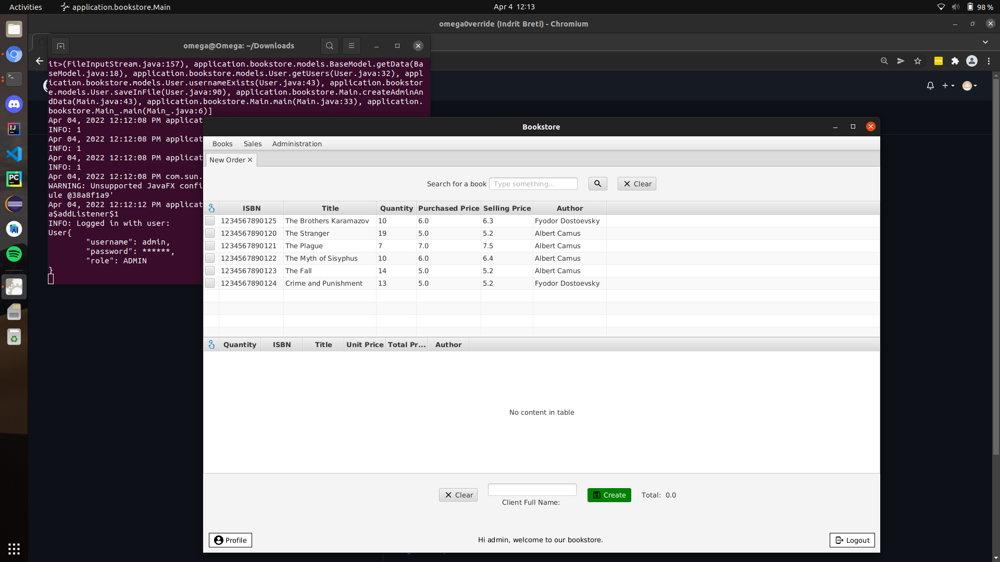

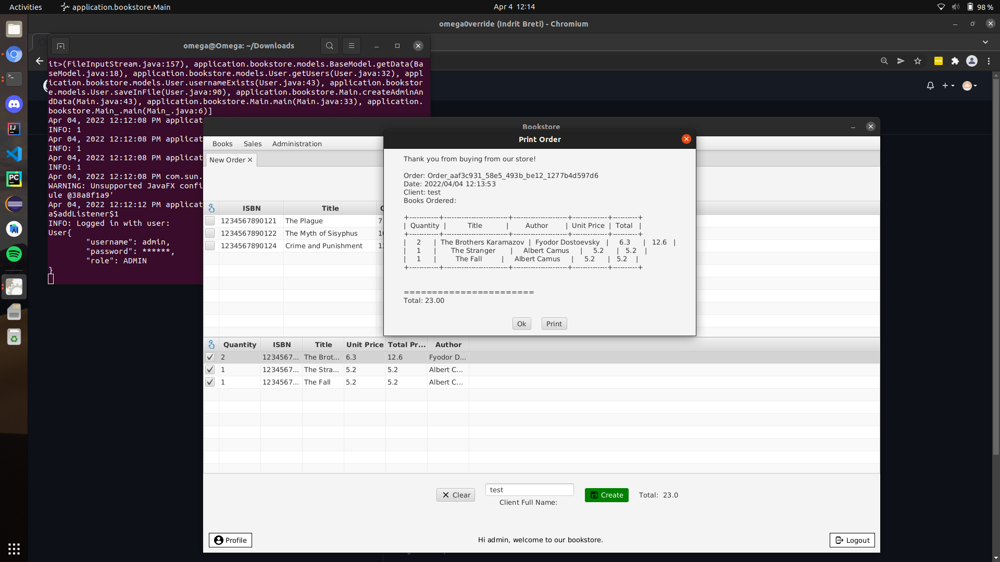
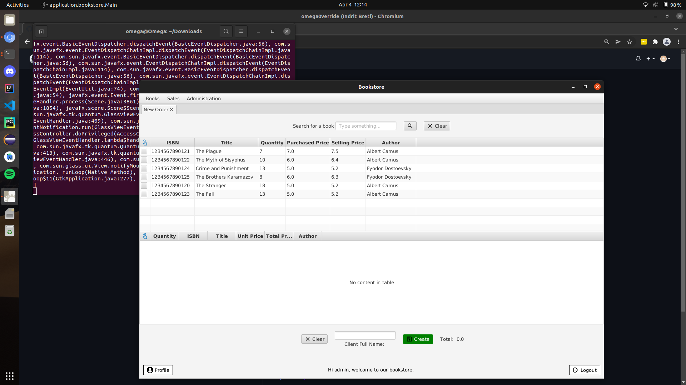
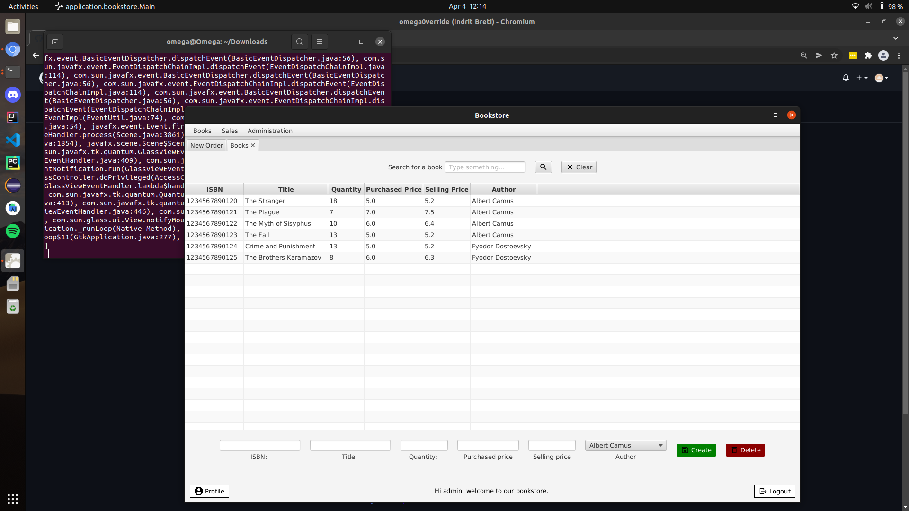
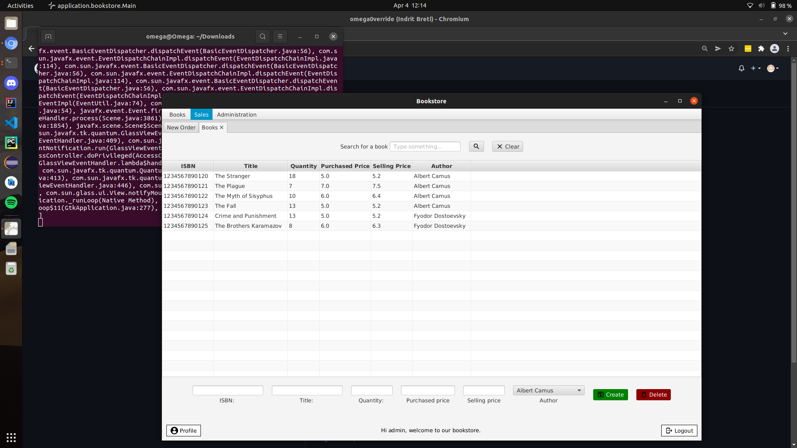
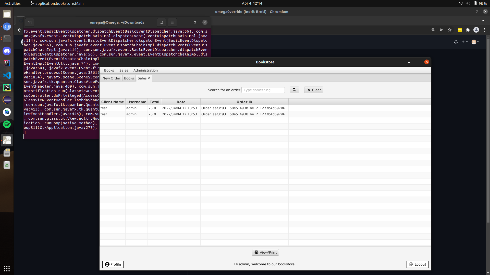
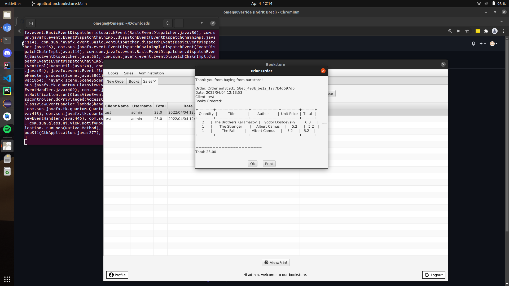
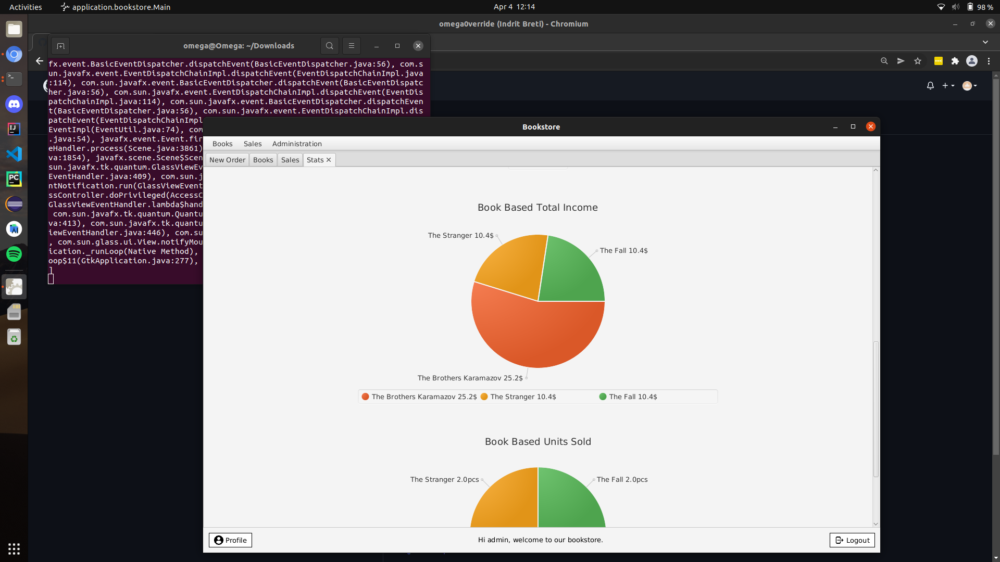

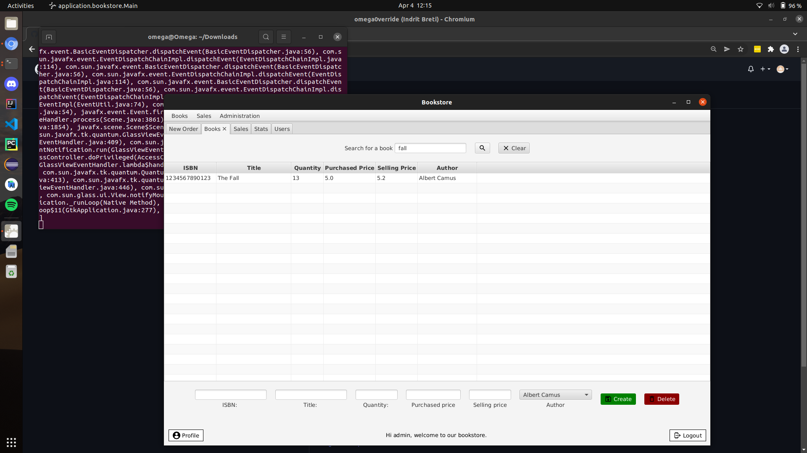
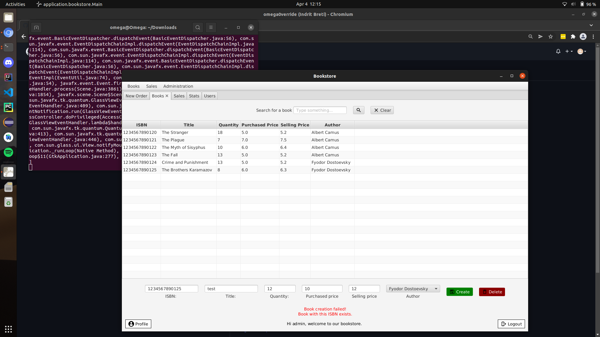
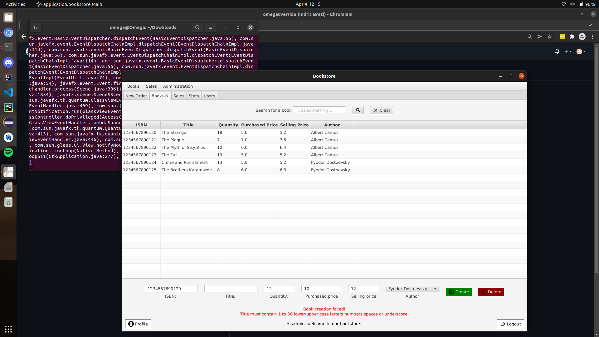

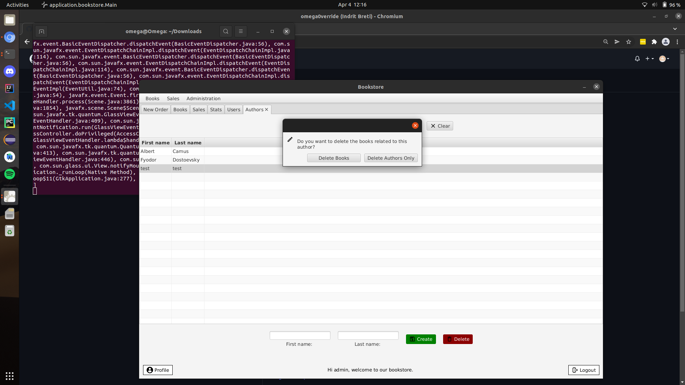
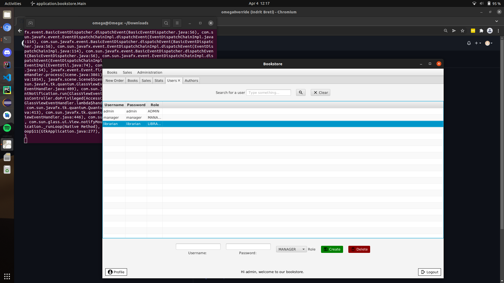
